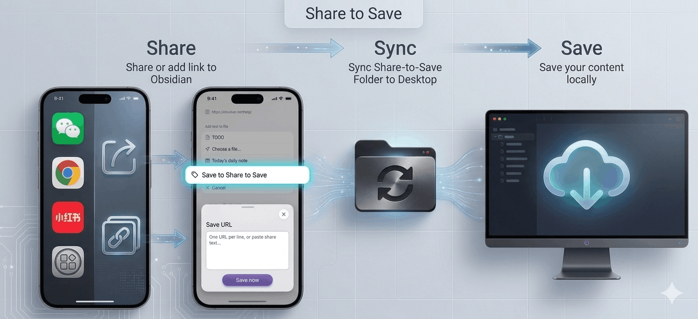

[中文](#中文) | [English](#share-to-save)

# Share to Save

An Obsidian plugin that automatically downloads web pages as Markdown notes, with quick text note capture.

**1. Save web pages:** Share / Add links from mobile → Auto-download on desktop → Save to your vault

**2. Save text:** Type text in the plugin input and save

**3. Quick capture:** Home screen shortcut for one-tap access to the input, see [Add to Home Screen](#add-to-home-screen) below

## Typical Usage

- **General Web Pages** — Any standard article page (news, blogs, documentation) works out of the box via the built-in defuddle fallback.
- **WeChat Articles** — Share an article from WeChat Official Accounts to Obsidian, and it will be saved with full text, images, and metadata intact.
- **Xiaohongshu (RED) Posts** — Copy a RED post link, add the link in the plugin, and both the text content and all images will be extracted and saved.
- **Quick Notes** — Home screen shortcut for one-tap access to the input, quickly capture fleeting thoughts or clipboard text

## Workflow

### 📱 Share or Add URL on Mobile → 💻 Auto-Download on Desktop

#### Web Page Saving

1. Share to Obsidian via the share button on your mobile device
2. Select "Save to Share-to-Save" in the share menu
3. Or click the plugin ribbon button, then paste a URL
4. URL is written to the queue file under the Share-to-Save folder
5. Sync to your desktop (see [Sync Methods](#sync-methods) below)
6. The desktop plugin detects the entry and automatically fetches the full web content, saving it as a `.md` note
7. On desktop, you can also click the ribbon button to directly enter a URL

#### Text Saving

Desktop ribbon button ☁️ or mobile menu ☰ → ☁️ input text → click "Save Text" button

## Installation

- **iOS Obsidian ≥ 1.13.0** — Obsidian 1.13 introduced a new share sheet menu. Install the plugin on **desktop only** (mobile not required). When sharing, select `Share-to-Save` as the target folder in the new share sheet menu.
- **iOS < 1.13.0 / Android** — Install the plugin on **both mobile and desktop**. Share via the in-app share menu (the plugin injects a "Save to Share-to-Save" button).

## Sync Methods

The plugin relies on file sync to transfer the queue file from mobile to desktop. We recommend one of the following:

| Method                                                                         | Cost | Speed            | Setup                                |
| ------------------------------------------------------------------------------ | ---- | ---------------- | ------------------------------------ |
| **[Fast Note Sync](https://github.com/haierkeys/obsidian-fast-note-sync/)** | Free | Instant          | Easy — another Obsidian plugin      |
| iCloud                                                                         | Free | ~1-10s           | Built-in on Apple devices            |
| Syncthing                                                                      | Free | ~1-5s            | Cross-platform, self-hosted          |
| Git                                                                            | Free | Manual push/pull | Versioned, but requires manual steps |

**Recommendation:** [Fast Note Sync](https://github.com/haierkeys/obsidian-fast-note-sync/) provides near-instant queue delivery — your desktop starts downloading within seconds of sharing on mobile. Unlike iCloud it works cross-platform, and unlike Syncthing it needs no separate daemon.

## Add to Home Screen

One-tap access to the plugin input from your home screen for quick note capture.

### iOS

Shortcuts app → New Shortcut → Add "Open URL" → `obsidian://share-to-save` → Share → Add to Home Screen

### Android

Use [Shortcut Maker](https://play.google.com/store/apps/details?id=rk.android.app.shortcutmaker) to create an Intent shortcut (see plugin settings for parameters).

## Submitting Issues

If you encounter extraction problems, please open an issue on [GitHub Issues](https://github.com/chenxiccc/obsidian-share-to-save/issues) with the following information:

1. **The URL** — The specific link you tried to save (required)
2. **What went wrong** — Which part was not extracted correctly? (title, author, body text, images, etc.)
3. **Failure type** — Is it:
   - **Cannot extract at all** (nothing saved, queue stuck, error message shown)
   - **Extraction is wrong** (saved but content is incomplete, garbled, or incorrect)

Providing a sample URL is essential — different pages on the same platform can have completely different HTML structures.

## License

MIT

This plugin bundles [defuddle](https://github.com/kepano/defuddle) (MIT © Steph Ango),
[turndown](https://github.com/mixmark-io/turndown) (MIT © Dom Christie), and
[@joplin/turndown-plugin-gfm](https://github.com/laurent22/joplin/tree/dev/packages/turndown-plugin-gfm) (MIT © Dom Christie).
See [LICENSE](LICENSE) for full license texts.

---

## 中文

Share to Save 是一款 Obsidian 插件，将网页自动下载为 Markdown 笔记，也可以快速记录闪念文字。

**1. 保存网页完整内容：** 手机端分享 / 添加链接 → 桌面端自动下载 → 保存到你的知识库

**2. 保存文字：** 插件输入框里输入文字，保存

**3. 闪念速记：** 桌面快捷方式一键直达输入框，见下方[创建桌面快捷方式](#创建手机桌面快捷方式-一键直达输入框闪念速记)

## 典型用法

- **通用网页** — 任何标准文章页面（新闻、博客、文档）均可通过内置 defuddle 兜底直接使用。
- **微信文章** — 分享微信公众号文章到 Obsidian，本地保存包括图片在内的全部内容。
- **小红书笔记** — 复制小红书链接，在插件中添加URL保存，本地保存笔记正文和全部图片。
- **闪念文字** — 桌面快捷方式一键直达输入框，快速记录闪念文字或剪贴板内文字

## 工作流程

### 📱手机分享或添加URL → 💻电脑自动下载

#### 网页保存

1. 手机端分享通过分享按钮 分享到 Obsidian
2. 在分享菜单里选择 保存到Share to Save
3. 也可以 点击插件ribbon按钮，粘贴添加URL
4. URL 写入 Share-to-Save文件夹下的队列文件
5. 同步到桌面端（见下方[同步方式](#同步方式)）
6. 桌面端插件检测到条目，自动获取网页全部内容，保存为 `.md` 笔记
7. 桌面端可直接点击ribbon按钮输入URL提取网页内容保存

#### 文字保存

电脑 ribbon 按钮 ☁️ 和 手机菜单 ☰ → ☁️，打开插件输入框，输入文字后点击”保存文字”按钮

## 安装说明

- **iOS Obsidian ≥ 1.13.0** — Obsidian 1.13 引入了新的原生分享菜单。插件**只需安装在桌面端**（手机无需安装）。分享时，在新分享菜单的 Folder 中选择 `Share-to-Save` 目录。
- **iOS < 1.13.0 / Android** — 需要在**手机和电脑上都安装**插件。通过 Obsidian 应用内分享菜单操作（插件会自动注入"保存到 Share to Save"按钮）。

## 同步方式

插件依赖文件同步将队列文件从手机传输到桌面。推荐以下方式：

| 方式                                                                           | 费用 | 速度             | 配置难度                 |
| ------------------------------------------------------------------------------ | ---- | ---------------- | ------------------------ |
| **[Fast Note Sync](https://github.com/haierkeys/obsidian-fast-note-sync/)** | 免费 | 即时             | 简单，免费，强大         |
| iCloud                                                                         | 免费 | ~1-10秒          | Apple 设备内置           |
| Syncthing                                                                      | 免费 | ~1-5秒           | 跨平台，需自托管         |
| Git                                                                            | 免费 | 需手动 push/pull | 有版本控制，但需手动操作 |

**推荐：**[Fast Note Sync](https://github.com/haierkeys/obsidian-fast-note-sync/) 可实现近乎即时的队列传送——手机端分享后几秒内桌面端即开始下载。相比 iCloud 支持跨平台，相比 Syncthing 无需额外后台进程。

## 创建手机桌面快捷方式 - 一键直达输入框，闪念速记

### iOS

快捷指令 App → 新建快捷指令 → 添加「打开 URL」→ 填入 `obsidian://share-to-save` → 分享按钮 → 添加到主屏幕

### Android

使用 [Shortcut Maker](https://play.google.com/store/apps/details?id=rk.android.app.shortcutmaker) 新建 Intent，填写 Action/Data URI 等参数（详见插件设置页）

## 提交 Issue

如有提取问题，请在 [GitHub Issues](https://github.com/chenxiccc/obsidian-share-to-save/issues) 提交，并提供以下信息：

1. **提供 URL 链接** — 你尝试保存的具体链接（必填）
2. **哪块提取不对** — 哪部分内容没有正确提取？（标题、作者、正文、图片等）
3. **完全不能提取还是提取错误** — 属于哪种情况：
   - **完全不能提取**（没有保存任何内容、队列卡住、显示错误信息）
   - **提取错误**（保存了但内容不完整、乱码或不正确）

提供示例 URL 至关重要——同一平台的不同页面可能拥有完全不同的 HTML 结构。

## 许可

MIT

本插件打包了 [defuddle](https://github.com/kepano/defuddle)（MIT © Steph Ango）、
[turndown](https://github.com/mixmark-io/turndown)（MIT © Dom Christie）和
[@joplin/turndown-plugin-gfm](https://github.com/laurent22/joplin/tree/dev/packages/turndown-plugin-gfm)（MIT © Dom Christie）。
完整许可证文本见 [LICENSE](LICENSE)。
